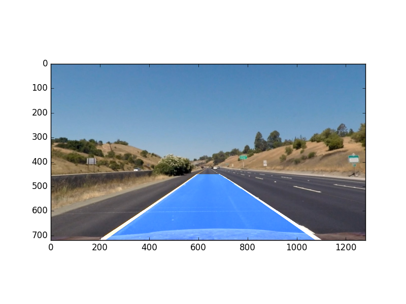
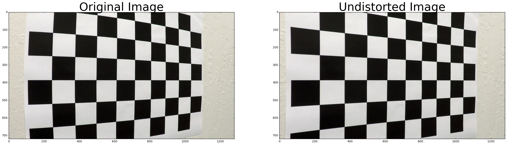
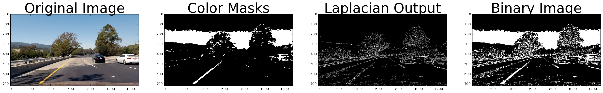
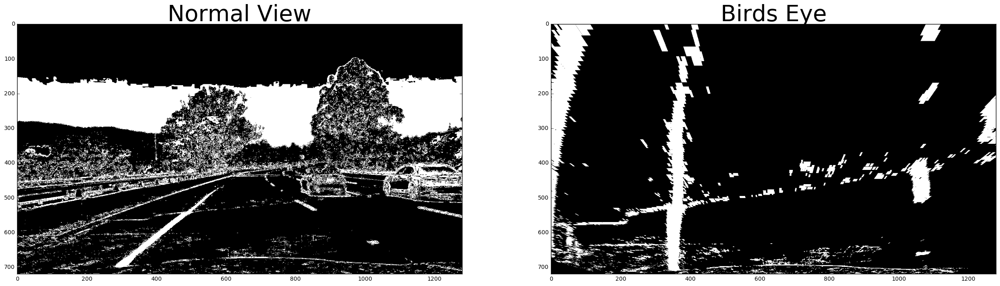
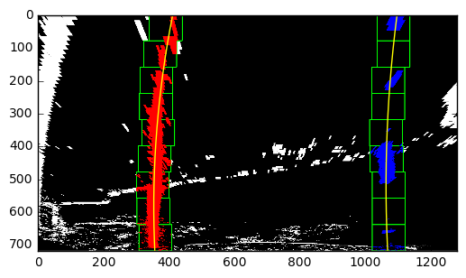
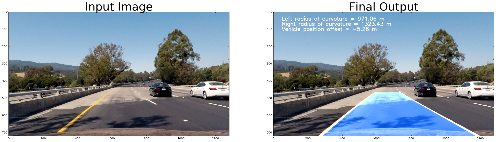

# Lane Finding with OpenCV

Lane finding is an important initial step to any
autonomous driving pipeline. Once the lanes are identified they can be used to
keep a vehicle from drifting into other lanes. This requires our lane finding
algorithm to be robust to varying light conditions and weather conditions. This
repo will be a basic tutorial on how to implement a robust lane finding
algorithm using OpenCV. The steps of this algortihm are:

* Apply a distortion
correction to raw images.
* Use color transforms, gradients, etc., to create a
thresholded binary image to identify lane pixels.
* Apply a perspective
transform to rectify binary image ("birds-eye view").
* Detect lane pixels and
fit to find the lane boundary.
* Warp the detected lane boundaries back onto the
original image.
* Output visual display of the lane boundaries and numerical
estimation of lane curvature and vehicle position.

The goal of the algortihm is
to take raw images and be able to transform them into images with lanes draw on
them as show below.

---
<figure>
<p align="center">
 
</p>
</figure>
 <p></p> 
<figure>
<p align="center">
 
</p>
</figure>

```python
#importing some useful packages
import numpy as np
import cv2
import matplotlib.pyplot as plt
import matplotlib.image as mpimg
import glob

img = mpimg.imread('./camera_cal/calibration5.jpg')
```

# Camera Calibration
Cameras that use lenses typically distort images by
stretching them unevenly. This is due to the light rays being refracted
differently depending on where they enter the lense. Fortunately OpenCV allows
us to calibrate our camera by taking pictures of chessboards at different angles
and mapping the detected corners to where the corners would appear in an
undistorted image. The chessboard images can be found in '/camera_cal/'

```python
def calibrate_camera():

    cal_images = glob.glob('camera_cal/calibration*.jpg')
    nx, ny = 9, 6

    objpoints = []  # 3D points
    imgpoints = []  # 2D points

    objp = np.zeros((nx*ny,3), np.float32)
    objp[:,:2] = np.mgrid[0:nx,0:ny].T.reshape(-1, 2)

    fname = cal_images[0]
    for fname in cal_images:
        img = cv2.imread(fname)
        gray = cv2.cvtColor(img, cv2.COLOR_BGR2GRAY)

        ret, corners = cv2.findChessboardCorners(gray, (nx, ny), None)
        if ret == True:
            objpoints.append(objp)
            imgpoints.append(corners)

    ret, mtx, dist, rvecs, tvecs = cv2.calibrateCamera(objpoints, imgpoints, gray.shape[::-1],None,None)

    return mtx, dist

cam_mtx, cam_dist = calibrate_camera()
undistored_img = cv2.undistort(img, cam_mtx, cam_dist, None, cam_mtx)

f, (ax1, ax2) = plt.subplots(1, 2, figsize=(24, 9))

ax1.imshow(img)
ax1.set_title('Original Image', fontsize=40)

ax2.imshow(undistored_img)
ax2.set_title('Undistorted Image', fontsize=40)
plt.subplots_adjust(left=0., right=1, top=0.9, bottom=0.)
plt.show()

```

<figure>
 
</figure>

# Color Transforms and Gradients
Now that we have an undistorted image we can
start identifying which pixels in the image we may think are lane pixels. The
most common approach is to run a filter through the image and then threshold the
output. Here I have chosen to use a laplacian filter since it tracks the delta
in both dimensions but it is by no means a requirement. 

After closer inspection one will find that for certain lighting and road conditions applying
a filter on a graysclae image doesn't work as wells as we would like. We can
instead transform our image to the HLS color space and then apply our laplacian
filter to the saturation and luminosity channels. Additionally we can also
create color masks by thresholding the raw pixel values. We combine the output
from our filtered image along with yellow and white color masks.

```python
img = mpimg.imread('./test_images/test4.jpg')
img = cv2.undistort(img, cam_mtx, cam_dist, None, cam_mtx)

def laplacian_threshold(img, sobel_kernel=3, mag_thresh=(0, 255)):

    lapacian = cv2.Laplacian(img, cv2.CV_64F,ksize=sobel_kernel)
    abs_lapacian = np.absolute(lapacian)
    scaled_lapacian = np.uint8(255*(abs_lapacian/np.max(abs_lapacian)))

    binary_output =  np.zeros_like(abs_lapacian)
    binary_output[(abs_lapacian >= mag_thresh[0]) & (abs_lapacian <= mag_thresh[1])] = 1

    return binary_output

def color_mask(hsv,img, min_thresh, max_thresh):

    mask = cv2.inRange(hsv, min_thresh, max_thresh)
    res = cv2.bitwise_and(img,img, mask= mask)
    return mask, res

HLS = cv2.cvtColor(img.astype(np.uint8), cv2.COLOR_RGB2HLS)
L = HLS[:,:,1]
S = HLS[:,:,2]
k_size = 3
s_lap_binary = laplacian_threshold(S, sobel_kernel=k_size, mag_thresh=(75, 255))
l_lap_binary = laplacian_threshold(L, sobel_kernel=k_size, mag_thresh=(75, 255))

HSV = cv2.cvtColor(img.astype(np.uint8), cv2.COLOR_RGB2HSV)
yellow_mask, yellow_img = color_mask(HSV,img, np.array([0,100,100]), np.array([60,255,255]))
white_mask, white_img = color_mask(HSV,img, np.array([20, 0, 180]), np.array([255,80,255]))

combined = np.zeros_like(s_lap_binary)
combined[(s_lap_binary == 1) | (l_lap_binary == 1)] = 1
combined[(yellow_mask > 0)|(white_mask > 0)] = 1

f, (ax1, ax2, ax3, ax4) = plt.subplots(1, 4, figsize=(24, 9))

ax1.imshow(img)
ax1.set_title('Original Image', fontsize=40)
ax2.imshow(yellow_mask+white_mask, cmap='gray')
ax2.set_title('Color Masks', fontsize=40)
ax3.imshow(s_lap_binary+l_lap_binary, cmap='gray')
ax3.set_title('Laplacian Output', fontsize=40)
ax4.imshow(combined, cmap='gray')
ax4.set_title('Binary Image', fontsize=40)
plt.subplots_adjust(left=0., right=1, top=0.9, bottom=0.)
plt.show()

```

<figure>
 
</figure>

# Perspective Transform and Fitting Lanes
With our binary image we're in
good shape to identify our lane boundaries, the tricky part however is how to
handle lanes that curve. To get a better understanding of the curvature of our
lanes it would be helpful to be able to look at the lane from a birds eye
perspective. OpenCV allows us to change perspective by identifying source points
and choosing how we would like to see those points positioned in the new
perspective. In other words we can choose our source points to be points on the
lane that currently are in a trapezoidal shape and choose the destination points
to be a rectangle.

```python
def perspective_change(img,inv=False):

    h, w = img.shape[0:2]
    src = np.array([[570. /1280*w, 465./720*h],
                    [715. /1280*w, 465./720*h],
                    [1100./1280*w, 720./720*h],
                    [200. /1280*w, 720./720*h]], np.float32)

    dst = np.array([[300. /1280*w, 0./720*h],
                    [1000./1280*w, 0./720*h],
                    [1000./1280*w, 720./720*h],
                    [300. /1280*w, 720./720*h]], np.float32)

    M = cv2.getPerspectiveTransform(src, dst)
    Minv = cv2.getPerspectiveTransform(dst, src)

    if inv:
        warped_img = cv2.warpPerspective(img, Minv, (w,h))
    else:
        warped_img = cv2.warpPerspective(img, M, (w,h))

    return warped_img

birds_eye = perspective_change(combined, inv=False)
birds_eye[birds_eye > 0 ] = 1
birds_eye = birds_eye.astype('uint8')

f, (ax1, ax2) = plt.subplots(1, 2, figsize=(24, 9))
ax1.imshow(combined, cmap='gray')
ax1.set_title('Normal View', fontsize=40)
ax2.imshow(birds_eye, cmap='gray')
ax2.set_title('Birds Eye', fontsize=40)
plt.subplots_adjust(left=0., right=1, top=0.9, bottom=0.)
plt.show()

```

<figure>
 
</figure>

Now we must find the pixels corresponding to each lane. To do this we can look
at a histogram of the x values of each nonzero pixel. We can find where the
pixels are concentrated and use the peaks as the base of our lanes.

<figure>
<p align="center">
 
</p>
</figure>

Once we have the base we separate the image into slices. Starting from the
bottom for each slice we find all the pixels that are in a certain window of the
base of the lane. We then use those pixels to recenter the window and find all
the lane pixels for the next slice. We repeat this process as we move up the
lane. Finally we fit a polynomial to all the pixels that we have gathered for
each lane.

```python
nwindows = 9
window_height = np.int(birds_eye.shape[0]/nwindows)
out_img = np.dstack((birds_eye,birds_eye,birds_eye))*255
margin = 50
minpix = 50

nonzero = birds_eye.nonzero()
nonzeroy = np.array(nonzero[0])
nonzerox = np.array(nonzero[1])


histogram = np.sum(birds_eye[birds_eye.shape[0]//2:,:], axis=0)
midpoint = np.int(histogram.shape[0]/2)
leftx_current  = np.argmax(histogram[:midpoint])
rightx_current = np.argmax(histogram[midpoint:])+midpoint

left_lane_inds = []
right_lane_inds = []

for window in range(nwindows):

    win_y_low = birds_eye.shape[0] - (window+1)*window_height
    win_y_high = birds_eye.shape[0] - window*window_height
    win_xleft_low = leftx_current - margin
    win_xleft_high = leftx_current + margin
    win_xright_low = rightx_current - margin
    win_xright_high = rightx_current + margin

    cv2.rectangle(out_img,(win_xleft_low,win_y_low),(win_xleft_high,win_y_high),(0,255,0), 2)
    cv2.rectangle(out_img,(win_xright_low,win_y_low),(win_xright_high,win_y_high),(0,255,0), 2)
    # Identify the nonzero pixels in x and y within the window
    good_left_inds = ((nonzeroy >= win_y_low) & (nonzeroy < win_y_high) & (nonzerox >= win_xleft_low) & (nonzerox < win_xleft_high)).nonzero()[0]
    good_right_inds = ((nonzeroy >= win_y_low) & (nonzeroy < win_y_high) & (nonzerox >= win_xright_low) & (nonzerox < win_xright_high)).nonzero()[0]

    # Append these indices to the lists
    left_lane_inds.append(good_left_inds)
    right_lane_inds.append(good_right_inds)

    # If you found > minpix pixels, recenter next window on their mean position
    if len(good_left_inds) > minpix:
        leftx_current = np.int(np.mean(nonzerox[good_left_inds]))
    if len(good_right_inds) > minpix:
        rightx_current = np.int(np.mean(nonzerox[good_right_inds]))
# Concatenate the arrays of indices
left_lane_inds = np.concatenate(left_lane_inds)
right_lane_inds = np.concatenate(right_lane_inds)

leftx = nonzerox[left_lane_inds]
lefty = nonzeroy[left_lane_inds] 
rightx = nonzerox[right_lane_inds]
righty = nonzeroy[right_lane_inds] 

# Fit a second order polynomial to each
left_fit = np.polyfit(lefty, leftx, 2)
right_fit = np.polyfit(righty, rightx, 2)

ploty = np.linspace(0, birds_eye.shape[0]-1, birds_eye.shape[0] )
left_fitx = left_fit[0]*ploty**2 + left_fit[1]*ploty + left_fit[2]
right_fitx = right_fit[0]*ploty**2 + right_fit[1]*ploty + right_fit[2]

out_img[nonzeroy[left_lane_inds], nonzerox[left_lane_inds]] = [255, 0, 0]
out_img[nonzeroy[right_lane_inds], nonzerox[right_lane_inds]] = [0, 0, 255]
plt.imshow(out_img)
plt.plot(left_fitx, ploty, color='yellow')
plt.plot(right_fitx, ploty, color='yellow')
plt.xlim(0, 1280)
plt.ylim(720, 0)
```

<figure>
<p align="center">
 
</p>
</figure>

# Radius of Curvature
Next we would like to know the curvature of the lane which
can be calculated directly from the coefficients of our fitted polynomial. We
also scale our (x,y) coordinates from pixels to meters to get a better real
world understanding of the curvature.

```python
ym_per_pix = 30/720 # meters per pixel in y dimension
xm_per_pix = 3.7/700 # meteres per pixel in x dimension

def rad_curv(xarray, yarray):
    fit = np.polyfit(yarray*ym_per_pix, xarray*xm_per_pix, 2)
    y_eval = np.max(yarray*ym_per_pix)
    curverad = (1 + (2*fit[0]*y_eval + fit[1])**2)**1.5/2/fit[0]
    return curverad

y_eval = np.max(lefty)
left_lane_radius_of_curvature = rad_curv(leftx, lefty)
right_lane_radius_of_curvature = rad_curv(rightx, righty)
lane_pos = (left_fitx[-1] + right_fitx[-1])//2
```

Finally with both lanes fitted and our curvature calculated we have all the
information we need to project the lane onto our image.

```python
draw_margin = 10
left_line_window1 = np.array([np.transpose(np.vstack([left_fitx-draw_margin, ploty]))])
left_line_window2 = np.array([np.flipud(np.transpose(np.vstack([left_fitx+draw_margin, ploty])))])
left_line_pts = np.hstack((left_line_window1, left_line_window2))
right_line_window1 = np.array([np.transpose(np.vstack([right_fitx-draw_margin, ploty]))])
right_line_window2 = np.array([np.flipud(np.transpose(np.vstack([right_fitx+draw_margin, ploty])))])
right_line_pts = np.hstack((right_line_window1, right_line_window2))
between_line_pts = np.hstack((left_line_window2, right_line_window1))

window_img = np.zeros_like(np.dstack((birds_eye,birds_eye,birds_eye)))
cv2.fillPoly(window_img, np.int_([left_line_pts]), (255,255,255))
cv2.fillPoly(window_img, np.int_([right_line_pts]), (255,255,255))
cv2.fillPoly(window_img, np.int_([between_line_pts]), (0,100, 255))
normal_view = perspective_change(window_img, inv=True)
final = cv2.addWeighted(img, 1, normal_view, 0.75, 0)

font = cv2.FONT_HERSHEY_SIMPLEX

cv2.putText(final,'Left radius of curvature = %.2f m'%(left_lane_radius_of_curvature),(50,50), font, 1,(255,255,255),2,cv2.LINE_AA)
cv2.putText(final,'Right radius of curvature = %.2f m'%(right_lane_radius_of_curvature),(50,80), font, 1,(255,255,255),2,cv2.LINE_AA)
cv2.putText(final,'Vehicle position offset = %.2f m'%((lane_pos - (final.shape[1]//2))*xm_per_pix),(50,110), font, 1,(255,255,255),2,cv2.LINE_AA)

f, (ax1, ax2) = plt.subplots(1, 2, figsize=(24, 9))
ax1.imshow(img)
ax1.set_title('Input Image', fontsize=40)
ax2.imshow(final)
ax2.set_title('Final Output', fontsize=40)
plt.subplots_adjust(left=0., right=1, top=0.9, bottom=0.)
plt.show()

```

<figure>
 
</figure>

# Discussion
This pipline works pretty well on a few test images but when used
on a video stream there were some problems. The pipline was still able to detect
the lanes in the right ball park but the detected lanes were very jitttery. To
alleviate this problem I used pixels gathered from previous **n** frames as well
as the current frame to smooth out the lanes transistions. Another technique
that also helped was to remove outlier pixels that were far away from most of
the pixels in the lane.

Other interesting techniques that I did not have time to
try were:
* Doing a weighted average of the previous pixels
* Rejecting frames
that resulted in a significant change in the curvature
* Doing a weighted
average of the polynomial coefficients

The current pipline has vunerablities because of its reliance on the color mask thresholds. The correct thresholds that can vary in different settings. The techniques above should definitely be tried in order to avoid the current pitfalls of the system.

Here is link to the output from the pipline on a video stream:

[](https://www.youtube.com/watch?v=T5kUmBSBjLI)

